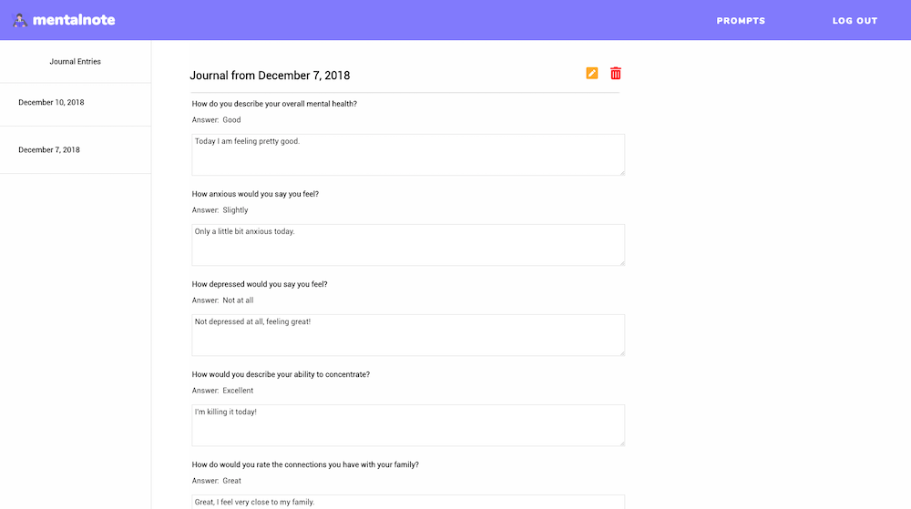

# Mentalnote

View a live demo [here](https://mentalnote.herokuapp.com "Mentalnote")!

## About The App

The intention behind MentalNote is to have an application where a user can log in and describe how they feel through a series of prompts every day. The prompts center around three categories: *the self*, *your friends*, and *your family*. The prompts have a score ranging from Poor to Excellent or Not At All to Extremely. Following the self score evaluation there is an text field for you to enter your response to each prompt.

Both the score and the text response are required, because the intention of the application is to be more like a journal that you can go over each prompt and then review your responses for that date at any point in the future.

## API Documentation

The API for this application is a simple CRUD(Create, Read, Update, Delete) API and has routes set up for each of these actions on a [separate server repo.](https://github.com/nathancleon/self-journal-server) 
Authentication is handled using [JSON Web Tokens](https://jwt.io/) and the application is complete with a **Log Out** link while using the application that returns you to the home page and deletes the token from local storage.

## Technology Stack

### Front End

This application was built using [React](https://reactjs.org/) and [Redux](https://redux.js.org/) for the front end of the application and styled using [Emotion](https://emotion.sh/), a CSS-in-JS library.

### Back End

The server was built using [Node](https://nodejs.org/en/), [Express](https://expressjs.com/), and authentication was completed using [JSON Web Tokens](https://jwt.io/).

The database was built using [MongoDB](https://www.mongodb.com/) and [mlab](https://mlab.com/).

### Testing

Front end testing was completed using [Jest](https://jestjs.io/) and server testing was completed with [Mocha](https://mochajs.org/) and [Chai](https://www.chaijs.com/) and uses [Travis CI](https://travis-ci.org/) for continuous integration testing.
